# 🌐 OSI Model 

<div class="tabs">
  <button class="tab active" onclick="openTab(event, 'theory')">Theory</button>
  <button class="tab" onclick="openTab(event, 'commands')">Commands</button>
</div>

<div id="theory" class="tab-content" style="display:block;">

</div>

<div id="commands" class="tab-content">

```mermaid
mindmap
  root((OSI Model))
    Layer 7: Application
      💻 HTTP, FTP, DNS
    Layer 4: Transport
      🔗 TCP vs UDP
    Layer 1: Physical
      🔌 Cables, Bits
```

```bash
# Show OSI Layer 3 info
show ip interface brief
# Debug Layer 4
debug tcp connections
```
</div>

<style>
.tabs button.active { background: #005073; color: white; }
.tab-content { display: none; }
</style>
<script src="../../assets/script.js"></script>
